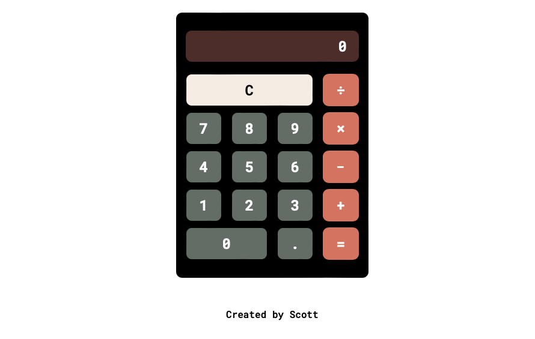

# Odin Calculator

This is the **_final project_** of the foundation path of [The Odin Project](https://www.theodinproject.com/lessons/foundations-calculator) and as the name suggests, students are required to create a simple web-based calculator for performing basic arithmetic operations. This calculator allows users to perform addition, subtraction, multiplication, and division operations.

## Features

- **Basic Arithmetic Operations**: Perform addition, subtraction, multiplication, and division calculations.
- **Clear Functionality**: Clear the input and start a new calculation.
- **Decimal Input**: Add decimal points to input numbers for more precise calculations.
- **Keyboard Support**: Use the keyboard for input and operations.

## Demo

You can try out the calculator by visiting the live demo [here](https://kotarohzk.github.io/odin-calculator/).
